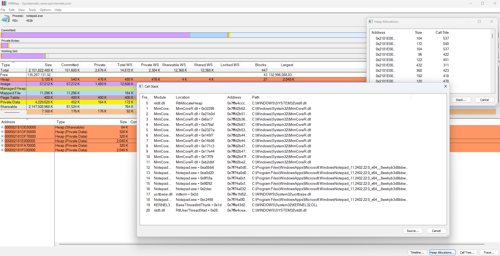

# Callstack Resolver
This tool resolves a symbol from a DLL image and its offset in a call stack.

## What is this?
This is a command-line tool to resolve symbols of a call stack without going through a debugger. It might be useful for engineers who are regularly investigating crashes or memeory leaks of a Windows application, or, addressing issues such as performance bottlenecks. For others, this tool would not be for yours and it would be better to simply use a debugger or Visual Studio. That is also a best option for us if possible.

We sometimes receive a bug report which suddenly tells us a call stack. It’s still a good case if a full dump or a mini dump file is attached, but sometimes they just send a list of modules + offset addresses. Since we are not wizards, all we can understand from that information is, at best, in which module the application get crashed. Or, we can look at which modules are called by the thread that get crashed.
Additionally, some performance analysis tools are poor at resolving symbols. This situation has been going on for over 10 years as far as I know. Reporting bugs or issues to the tools' developer is one option, but if we just want to resolve the symbols of a call stack, Microsoft already provides an API called dbghelp.lib. It’s easy to resolve symbols using it. So let’s do that.

## Quick Tutorial
Let’s skip the detailed explanation for now and try to resolve some symbols in a call stack. To get a call stack with unresolved symbols as an example, we will extract a call stack when notepad.exe secures a heap using VMMap and then try to resolve the symbols with this tool.

First, launch Notepad.exe from VMMap, select an appropriate segment from the secured heaps, and open the Callstack window. VMMap itself has the function to download symbols from the symbol server and resolve symbols, but this time, we want to try resolving symbols outside of it, so we intentionally disable the symbol server settings.


Since we cannot directly copy and paste the strings from the Callstack window, we first capture the area we want to convert to text with the Snipping Tool. Launch the Snipping Tool with the [Windows][Shift][s] shortcut and capture the area of the text. After that, just press the [Text Actions] button to convert them in strings. Coppy the callstack strings to `callstacks.txt`. You can also copy the paths to DLLs in the same way.


The following is the content of `callstacks.txt`. `--- paths` and `--- callstacks` are delimiters. The unresolved symbols are related to Notepad.exe and MrmCoreR.dll. It's impossible to get the symbol information for Notepad.exe from MS's symbol server, but we should be able to get the symbol for MrmCoreR.dll, so they will be resolved.
 ```
--- paths
C:\WINDOWS\SYSTEM32\ntdll.dll
C:\WINDOWS\System32\ucrtbase.dll
C:\WINDOWS\System32\KERNEL32.DLL
C:\Windows\System32\MrmCoreR.dll
C:\Program Files\WindowsApps\Microsoft.WindowsNotepad__11.2402.22.0_x64_8wekyb3d8bbwe\Notepad\Notepad.exe

--- callstacks
RtlAllocateHeap
MrmCoreR.dll + 0x32298
MrmCoreR.dll + 0x21b0d
MrmCoreR.dll +0x6a17
MrmCoreR.dll + 0x379af
MrmCoreR.dll +0x2327a
MrmCoreR.dll + 0x145f7
MrmCoreR.dll + 0x14b86
MrmCoreR.dll + 0x171c3
MrmCoreR.dll + 0x17e44
MrmCoreR.dll + 0x17f79
MrmCoreR.dll + 0xb2dbf
Notepad.exe + 0xa0bb6
Notepad.exe + 0xa0d20
Notepad.exe + 0x9f18a
Notepad.exe + 0x9f292
Notepad.exe + 0x2dac
initterm + 0x2d
Notepad.exe + 0xc2498
Base ThreadlnitThunk + 0x1d
RtlUserThreadStart+0x28
 ```

In addition to the above-mentioned `callstack.txt`, `config.json` is also required to run this tool. It describes to download the PDBs from Microsoft’s symbol server and save them in the `.\PDB_Cache folder`.

```
{
    "symbols": [
        {
          "server": "https://msdl.microsoft.com/download/symbols",
          "cache": ".\\PDB_Cache",
          "force_create_cache_dir": true
        }
    ]
}
```

All that’s left is to run `CallstackResolver.exe`. The two files mentioned above should be placed with the exe. If the result is as follows, it is successful.
```
Using default config file, "D:\gitHub\shikihuiku\CallstackResolver\x64\Debug\config.json".
Using default input callstack file, "D:\gitHub\shikihuiku\CallstackResolver\x64\Debug\callstacks.txt".
Failed to resolve symbol. Failed to find the PDB for "C:\Program Files\WindowsApps\Microsoft.WindowsNotepad_11.2402.22.0_x64__8wekyb3d8bbwe\Notepad\Notepad.exe".
Failed to resolve symbol. Failed to find the PDB for "C:\Program Files\WindowsApps\Microsoft.WindowsNotepad_11.2402.22.0_x64__8wekyb3d8bbwe\Notepad\Notepad.exe".
Failed to resolve symbol. Failed to find the PDB for "C:\Program Files\WindowsApps\Microsoft.WindowsNotepad_11.2402.22.0_x64__8wekyb3d8bbwe\Notepad\Notepad.exe".
Failed to resolve symbol. Failed to find the PDB for "C:\Program Files\WindowsApps\Microsoft.WindowsNotepad_11.2402.22.0_x64__8wekyb3d8bbwe\Notepad\Notepad.exe".
Failed to resolve symbol. Failed to find the PDB for "C:\Program Files\WindowsApps\Microsoft.WindowsNotepad_11.2402.22.0_x64__8wekyb3d8bbwe\Notepad\Notepad.exe".
Failed to resolve symbol. Failed to find the PDB for "C:\Program Files\WindowsApps\Microsoft.WindowsNotepad_11.2402.22.0_x64__8wekyb3d8bbwe\Notepad\Notepad.exe".
--- Resolved Callstacks ---
RtlAllocateHeap
MrmCoreR.dll!Microsoft::Resources::DynamicPackageProfile::InitPackagesInfo + 0x1dc
MrmCoreR.dll!Microsoft::Resources::DynamicPackageProfile::InitPackagesInfo + 0xb5
MrmCoreR.dll!Microsoft::Resources::MetroAppClientProfile::CreateInstance + 0xdf
MrmCoreR.dll!Microsoft::Resources::MrmProfile::ChooseDefaultProfile + 0x1ff
MrmCoreR.dll!Microsoft::Resources::Runtime::CResourceManagerInternal::InitializeWithProfile + 0x92
MrmCoreR.dll!Microsoft::Resources::Runtime::CResourceManagerInternal::s_CreatePackageDefaultResourceManagerInternal + 0xf3
MrmCoreR.dll!Microsoft::Resources::Runtime::CResourceManagerInternal::s_GetPackageDefaultResourceManagerInternal + 0x1e
MrmCoreR.dll!Windows::ApplicationModel::Resources::Core::CResourceManagerFactory::get_Current + 0xe3
MrmCoreR.dll!Windows::ApplicationModel::Resources::Core::CResourceContextFactory::s_GetSingletonResourceManager + 0x70
MrmCoreR.dll!Windows::ApplicationModel::Resources::Core::CResourceContextFactory::GetForViewIndependentUse + 0x29
MrmCoreR.dll!Windows::ApplicationModel::Resources::CResourceLoaderFactory::GetForViewIndependentUseWithName + 0xcf
Notepad.exe!0xa0bb6
Notepad.exe!0xa0d20
Notepad.exe!0x9f18a
Notepad.exe!0x9f292
Notepad.exe!0x2dac
initterm + 0x2d
Notepad.exe!0xc2498
Base ThreadlnitThunk + 0x1d
RtlUserThreadStart+0x28
```

The symbol for MrmCoreR.dll has been resolved. The symbol for Notepad.exe failed to be obtained, but this was expected. At the same time, a folder named PDB_Cache was created, and MrmCoreR.pdb was downloaded and saved in it. Now it's time to finish the Quick Tutorial.

## How this tool works.
This tool accesses a PDB information through Microsoft’s dbghelp.lib and resolves a symbol from an offset address in a module. The minimum information required for this is a PDB file and its offset address. If you have these two, the tool can access the PDB file and get the closest symbol information and, if available, it also retrieves the line information of the source code. Instead of specifying the PDB file directly, you can also specify a DLL or a EXE. This is more expected work flow. DLLs provided by Microsoft and third parties usually have multiple versions with the same name. To identify these correctly, the tool needs to access the DLL binary and calculate the signature for the PDB (which is something like a checksum). Once the tool calculates the signature of the PDB, it can query the server that stores the symbol (PDB file) of that DLL via HTTP and download it. This tool can download the corresponding PDB file by querying multiple servers. One typical example is the symbol server provided by Microsoft, where you can download the symbols of most DLLs derived from MS. If you have your own private symbol server, this tool can download PDBs from there. Once you have the right PDB file, this tool will access the PDB via the dbghelp.lib API and resolve the symbol for the specified offset address.

## How to build
1. Do `git clone --recursive` to download the files and submodules. 
1. Install Windows SDK to get dbghelp.lib/dll
1. Open CallstackResolver.vcxproj with Visual Studio and build the project.

## Input files
### config.json
Actually, `config.json` can hold the `paths` and `callstacks` that `callstack.txt` had. For example, you can describe the callstack to be resolved in a json file as follows. This is useful when passing the contents of the json file to this tool via standard input.
```
{
  "symbols": [
    {
      "server": "https://msdl.microsoft.com/download/symbols",
      "cache": ".\\PDB_Cache",
      "force_create_cache_dir": true
    },
    {
      "cache": "X:\\Other_PDB_Cache"
    },
    {
      "direct": "X:\\PDB_Path_Without_PDB_Signature"
    }
  ],
  "paths": [
    "C:\\WINDOWS\\SYSTEM32\\ntdll.dll",
    "C:\\WINDOWS\\System32\\KERNEL32.DLL"
  ],
  "callstacks" : [
    "ntdll.dll + 0x219a",
    "KERNEL32.DLL +0x253b4"
  ]
}
```

For example you can input a json strings via standard input and also get the result as a json string.

```
CallstackResolver.exe --cin --json < ..\..\config_example.json
```

With `--config` option, you can change the json file path.
```
CallstackResolver.exe --config another_config.json
```

### callstacks.txt
This is just a handy text file to describe the `paths` and `callstacks` elements of `config.json`. The file doens't need to follow json syntax so we don't need to escape `\` or place a double quotation at a boundary of a string. 
```
--- paths
C:\WINDOWS\SYSTEM32\ntdll.dll
C:\WINDOWS\System32\KERNEL32.DLL

--- callstacks
ntdll.dll + 0x219a
KERNEL32.DLL +0x253b4
```

With `--text` option, you can freely change the file's path.
```
CallstackResolver.exe --text another_callstacks.txt
```

## Command Options
- `--config filename` Set `filename` as `config.json` file.
- `--text filename` Set `filename` as `callstacks.txt` file.
- `--verbose` To show extra messages while executing.
- `--json` Output result will be formed in json format.
- `--cin` Use standard input stream as `config.json`.


